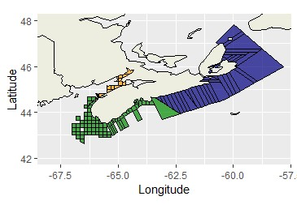
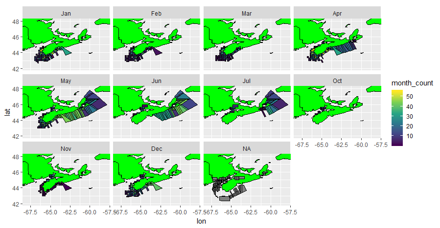

```{r setup, include=FALSE}
knitr::opts_chunk$set(echo = TRUE)
```

# Introduction

  The American lobster (Homarus americanus) is found along the Atlantic coast of North America from North Carolina to Labrador and is harvested commercially [@Lydon2003]. Lobsters are important to humans economically, making-up 6.8% of the world’s total marine crustacean catch, with the American lobster as the most prominent (Cobb 1980). The American lobster industry was valued at $1.5 billion USD in 2015 and was the most important fishery across the United States and Canada (Le Bris et al. 2017). In Nova Scotia, there are over 5,000 lobstermen earning approximately $502 million CAD total in 2017 [@Comeau2018]. The amount of money a lobsterman makes is proportional to the quantity of lobsters caught. Lobster fishing is important to humans because it provides job security, money and food [@Lydon2003]. 

  American lobster tends to grow 25 cm long and weigh 0.5 kg on average, and they live long lives of 50 or more years. They are typically found in the North Atlantic where the water temperatures are colder at depths of 365 meters (around the edge of the continental slope). Their habitat is determined by the amount of shelter in the given area; they tend to live behind rocky substrate and some burrow themselves in mud or dig themselves a hole to live in [@Lydon2003]. The life cycle of the American lobsters begins with the larval and post larval stages followed by a juvenile stage which occupies three to five years of their early life. Once they grow to maturity they live a long life in which they can reproduce multiple times. Males tend to be larger than females, but their size and growth rate vary depending on location and temperature. Generally, American lobsters have higher growth rates in warmer waters. Lobsters that grow the fastest and mature at an earlier age (76 mm versus 97 mm length at maturity), tend to live in warmer water. Lobsters inhabiting warmer regions such as the Southern Gulf of St. Lawrence and Southern New England are faster growing than lobsters in the cooler areas such as the Bay of Fundy and Northern Gulf of St Lawrence [@Phillips2008]. 

  A Marine Heat Wave (MHW) is characterised by an anomalously warm event where the sea temperatures rise over the 90th percentile, lasting greater than five days [@Hobday2016]. MHWs may cause changes in species migration and distribution patterns and can alter their growth and development rates [@Mills2013]. MHWs have caused species to shift their distribution northward. For example, species such as silver hake (Merluccius bilinearis), red hake (_Urophycis chuss_), yellowtail flounder (_Pleuronectes ferruginea_) and winter flounder (_Pseudopleuronectes americanus_) have been found to be moving northward to compensate for the increase in temperature in parts of their range [@Mills2013]. MHWs have occurred on coral reefs in the past decade (Hoegh-Guldberg 1999). Corals are not tolerant to high temperature waters [@Hoegh1999]. When the water gets too warm, their photosynthetic symbionts die, making them unable to produce food needed to live [@Hoegh1999]. The coral bleaches, and their death consequently causes other species to leave [@Hoegh1999]. Impacts of MHWs on marine ecosystems can influence humans as well if the MHW impacts species that humans use for selling and eating.
  
### Objectives
  Researchers have determined that the temperatures on the Northeast shelf of North America have increased [@Mills2013]. MHW’s do play a role in this, however, they do not cause long term changes in temperature since they are only temporary. The distribution of silver and red hake, and yellowtail and winter flounder has shifted to more northern and deeper waters to compensate for this rise in temperature [@Mills2013]. Researchers have yet to investigate the impacts of MHWs on lobsters. The objective of this study is to examine the occurrence of MHWs and their potential impact on catch per unit effort (CPUE) of lobster across the coastal shelf of Nova Scotia. I predict that MHWs will have a positive effect on the American lobster population and subsequently on lobster harvest (as measured by CPUE) because of their improved ability to grow in warmer temperatures. 

# Methods
### Data Collection

The data used in this research were collected by lobstermen between 2006 and 2016. Lobstermen attached a thermometer to the outside of each trap they set to measure the temperature of the water at the ocean floor. Each week, the lobster harvesters recorded the temperature and the number of lobsters in each trap. This data was given to fisheries managers who calculated CPUE. CPUE is a population index that measures how much was caught per amount of time and effort spent fishing.

### Data Analysis

We analysed the data collected by lobsterman across Nova Scotia using R, an open source statistical analysis program that is available on the web. R is important to our study because it allows us to create and alter statistical analyses to examine the correlation between MHWs and CPUE for our study. The data will be divided into three study areas (North, South and Fundy) due to discrepancies in the data collected by the lobstermen. Correlations and linear regression models were completed through R, for each study area.

### Timeline

First, we calculated the magnitude of the MHWs in the studied area (3 hours of work). Then, using this information, we ran a correlation (3 hours of work) and performed a linear regression model between MHWs and lobster CPUE data (3 hours of work). The results are saved, and using R, graphs and figures are generated (3 hours of work) to highlight our findings. At this time, a map of the study area is made. Finally, we interpret whether MHWs have a positive or negative impact on the CPUE of lobsters in the Nova Scotia area. The correlation value will determine whether MHWs have a positive or negative impact on the lobster industry.

# Results

The correlations between CPUE and different variables with respect to MHWs had different results. This depended on what the CUPE was compared to and the study area. When the CUPE was compared with the duration of the MHW, there was negative correlation; North being -0.0899, South being -0.331 and Fundy being -0.331. In contrast, when comared to the mean intensity of the MHW to the relative threshold, the South and Fundy study areas produced strong positive coefficients of correlation whereas North was a weak negative; North being -0.0149, South being 0.601, and Fundy being 0.601.

Correlations were calculated for each of the three areas separately.The studied area was divided into three different sections because of where and when the data was collected (Figure 1). The temperature was recorded in different locations at different times throughout the year, as can be seen in Figure 2. It can be observed that temperatures were mostly recorded from April to July in the Northern Area, from December to May in the Southern area, and from April to July and October to December in the Fundy area. 

 






Figure 3 shows two maps where the mean temperature and CPUE are graphed respectively. It is visible which locations had the highest and lowest mean temperatures and CPUE values in the studied ten year time span.


#Literature Cited