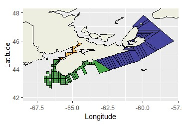
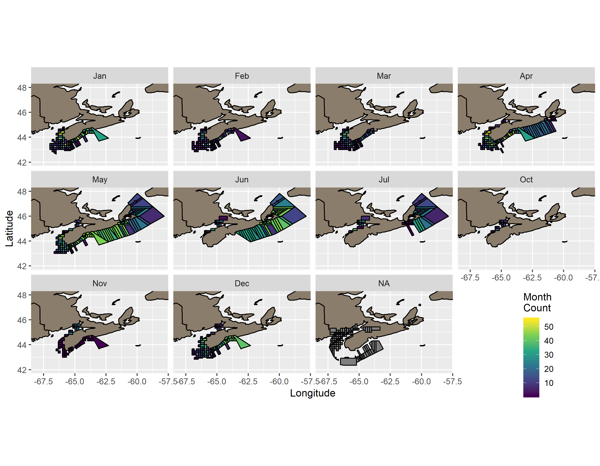

```{r setup, include=FALSE}
knitr::opts_chunk$set(echo = TRUE)
```

#Abstract

Marine heatwaves (MHW) are known to have significant impacts on marine life. This study aimed to determine the impact of MHWs on the populations of American lobster (Homarus americanus) off the coast of Nova Scotia. Lobsters may benefit from warmer ocean bottom temperatures; however, researchers are unsure of the exact impact that MHWs may have. Over ten years of data collected from lobstermen were analyzed using the computer program R. It was observed that lobsters seem to benefit from short MHWs. This means that the CPUE of the American lobster seems to increase as MHWs occur due to the increased ocean bottom temperatures.

# Introduction

 The American lobster (_Homarus americanus_) is found along the Atlantic coast of North America from North Carolina to Labrador and is harvested commercially [Lydon 2003]. Lobsters are important to humans economically, making-up 6.8% of the world’s total marine crustacean catch, with the American lobster as the most prominent [Cobb 1980]. The American lobster industry was valued at $1.5 billion USD in 2015 and was the most important fishery across the United States and Canada [Le Bris et al. 2017]. In Nova Scotia, there are over 5,000 lobstermen earning approximately $502 million CAD total in 2017 [Comeau 2018]. The amount of money a lobsterman makes is proportional to the quantity of lobsters caught. Lobster fishing is important to humans because it provides job security, money and food [Lydon 2003]. 
 
  American lobster tends to grow 25 cm long, weigh 0.5 kg on average, and live long lives of 50 or more years. They are typically found in the North Atlantic where the water temperatures are colder at depths of 365 meters (around the edge of the continental slope). Their habitat is determined by the amount of shelter in the given area; they tend to live behind rocky substrate and some burrow themselves in mud or dig themselves a hole to live in [Lydon 2003]. The life cycle of the American lobster begins with the larval and post larval stages followed by a juvenile stage which occupies three to five years of their early life. Once they grow to maturity they live a long life in which they can reproduce multiple times. Males tend to be larger than females, but their size and growth rate vary depending on location and temperature. Generally, American lobsters have higher growth rates in warmer waters. Lobsters that grow the fastest and mature at an earlier age (76 mm versus 97 mm length at maturity), tend to live in warmer water. Lobsters inhabiting warmer regions such as the Southern Gulf of St. Lawrence and Southern New England are faster growing than lobsters in the cooler areas such as the Bay of Fundy and Northern Gulf of St Lawrence [Phillips 2008].

  A marine  heatwave (MHW) is characterized by an anomalously warm event where the sea temperatures rise over the 90th percentile, lasting greater than five days [Hobday et al. 2016]. MHWs may cause changes in species migration and distribution patterns and can alter their growth and development rates [Mills et al. 2013]. MHWs have caused species to shift their distribution northward. For example, species such as silver hake (_Merluccius bilinearis_), red hake (_Urophycis chuss_), yellowtail flounder (_Pleuronectes ferruginea_) and winter flounder (_Pseudopleuronectes americanus_) have been found to be moving northward to compensate for the increase in temperature in parts of their range [Mills et al. 2013]. MHWs have occurred on coral reefs in the past decade, which is problematic because corals are not tolerant to high temperature waters [Hoegh-Guldberg 1999]. When the water gets too warm, their photosynthetic symbionts die, making them unable to produce food needed to live [Hoegh-Guldberg 1999]. The coral bleaches, and their death consequently causes other species to leave [Hoegh-Guldberg 1999]. Impacts of MHWs on marine ecosystems can influence humans as well if the MHW impacts species that humans use for selling and eating.
  
### Objectives
  Researchers have determined that the temperatures on the Northeast shelf of North America have increased [Mills et al. 2013]. MHWs do play a role in this, however, they do not cause long term changes in temperature since they are only temporary. The distributions of silver & red hake, yellowtail, and winter flounder have shifted to more northern and deeper waters to compensate for this rise in temperature [Mills et al. 2013]. Researchers have yet to investigate the impacts of MHWs on lobsters. The objective of this study was to examine the occurrence of MHWs and their potential impact on catch per unit effort (CPUE) of lobster across the coastal shelf of Nova Scotia. I hypothesized that MHWs would have a positive effect on the American lobster population and subsequently on lobster harvest (as measured by CPUE) because of lobsters improved ability to grow in warmer temperatures.
  
# Methods
### Data Collection

The data used in this research were collected by lobstermen between 2006 and 2016. Lobstermen attached a thermometer to the outside of each trap to measure the temperature of the water at the ocean floor. Each week, the lobster harvesters recorded the temperature and the number of lobsters in each trap. Data were given to fisheries managers who calculated CPUE, a population index that measures the number caught per amount of time (effort) spent fishing. The region of data collection that each lobsterman was responsible for, was divided and recorded per grid cell as seen in Figure 1.


### Data Analysis

We analyzed the data using R, an open source statistical analysis program (R Core Team 2018). R is important to our study because it allows us to perform statistical analyses that examine the correlation between MHW metrics and CPUE for our study. Since the data were collected per grid cell, and due to differences in data collection methods between the lobstermen, the data were divided into three study areas (North, South, and Fundy) (Figure 2). Correlations were also calculated for each of the three areas separately because the temperatures were recorded in different locations at different times throughout the year; April to July in the Northern Area, December to May in the Southern area, and April to July and October to December in the Fundy area (Figure 3).
 The MHWs were calculated using the heatwaveR package in R. This package allowed us to examine MHWs and compare them to the CPUE of lobsters in the region.  Tests were conducted for different aspects of the MHW: the number of events per year, the average duration of events per year, the average event decline rate, the average event mean intensity and maximum or peak intensity, the intensity variability, and all intensities relative to the 90th percentile threshold.








# Results

Ten year mean temperature and CPUE varied among study areas as seen in Figure 4. The North region had some of the lowest temperatures and CPUE values, and the South and Fundy areas had warmer temperatures and higher values of CPUE. Occurrence and maximum intensity of MHWs throughout the ten-year time span of the study are shown in Figure 5.


The correlation coefficients (Pearson r) between CPUE and the duration of MHWs were -0.462, -0.661 and -0.463, for the North, South and Fundy areas respectively. In contrast, the correlations between CPUE and average mean intensity of the MHW relative to the 90th percentile threshold, were weakly negative in the North (-0.0149) and strongly positive for the South and Fundy areas (both 0.601) (Figure 6).


#Discussion

The American lobster is a commercially and ecologically significant species found along the Atlantic coast of North America [@Lydon2003]. This species has been found to grow faster in warmer ocean bottom temperatures [@Phillips2008], which may lead to larger CPUE values. Our study examined the correlation between the CPUE of the American lobster with respect to MHWs. Specifically, we examined CPUE of lobsters off the coasts of Nova Scotia in the North, South and Fundy areas relative to the ocean bottom temperature and the duration of MHWs.

The results supported the hypothesis. Lobsters are cought more frequently when the ocean bottom temperatures are elaveted during MHWs. We did not expect to find however, that the duration was the key factor in lobster CPUE. When MHWs are short, the CPUE is the highest. When MHWs are longer, the CPUE is lower.

When the CPUE was compared to longer durations of MHWs, for all three regions, the CPUE was decreased. This means that the abundance of lobsters was decreased when the MHW lasted for a long period of time. When the CPUE was compared to the temperature of the MHWs, there was an increased CPUE in the South and Fundy areas. The lobsters in these regions were cought more often when the ocean bottom temperatures were warmer.In contrast, when the CPUE in the North was compared with ocean bottom temperatures, the CPUE decreased. This difference in CPUE between the North and the South/Fundy areas could be because the Northern region contains area of the Bras d'Or seas. 

In their study, @McMahan2016 studied the growth of American lobsters in a warming ocean enviromnent. They observed that if the increased growth rate of lobsters is influenced by the ocean bottom temperatures, then the lobsters could be harvested at a younger age. This could be commercially significant because lobstermen could potentially harvest lobsters more frequently. Similar to @McMahan2016, we found that there is an abundance of lobsters when ocean bottom temperatures are warmer. Although, if the high temperatures are long lasting, this could have negative effects on their population size.

#Conclusion

In conclusion, the CPUE of the American lobster seems to increase as MHWs occur due to the increased ocean bottom temperatures. However, the longer lasting MHWs cause a decrease in CPUE. Therefore, a short lived MHW should produce the largest CPUE of lobsters in the South and Fundy regions. If the MHWs last for too long, this will have negative impacts on the lobster CPUE. Although this study produced significant conclusions about the CPUE of lobsters with respect to MHWs, there can be no definitive conclusion as to whether lobsters CPUE is positively impacted by MHWs because the study was only performed over a time span of ten years.


#Literature Cited