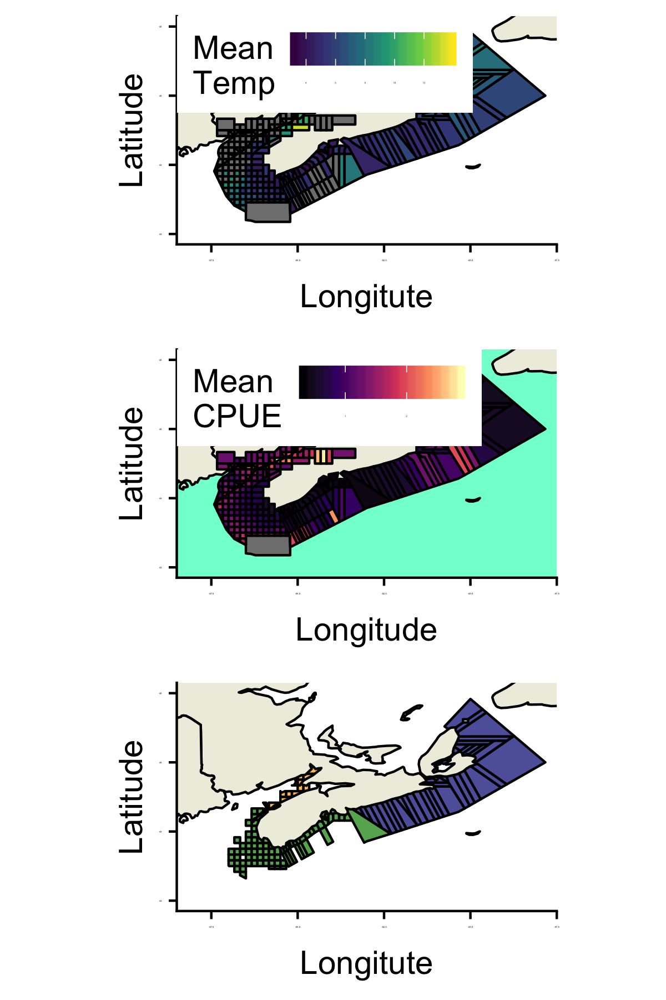

```{r setup, include=FALSE}
knitr::opts_chunk$set(echo = TRUE, fig.height = 2)
```

##Introduction

The American lobster (Homarus americanus) is currently the most important species in the fishing industry in North America [@LeBris2018]. In 2015, the combined landed value of the species in Canada and the United States was 1.5 billion dollars [@LeBris2018]. The lobster industry such as; lobster fishing and lobster processing, impacts the economy of many coastal North American locations. The Canadian federal government makes a total revenue of more than 25 million dollars based on New Brunswick’s catches alone (Desjardins 2007).

The increase of lobster supply depends on the species’ range in an area. According to Arnault Le Bris (2017), the Gulf of Maine fishery is located near the center of the species’ range, whereas the fishery in Southern New England is a warmer coastal location. The severe warming rate in the northwest Atlantic waters could account for the effective increase in lobster catches in the Gulf of Maine fishery and the decrease in the number of catches in the Southern New England fishery (cite). However, the Gulf of Maine has adopted a stronger conservation process than the Southern New England fishery. Therefore, the Gulf of Maine fishery anticipated and proactively responded to warming seawaters increasing the chances of survival of the lobster in that region (Le Bris et al. 2017). 
According to DISP 2018’s research project on the correlation between the bottom of the ocean’s temperature and the number of catches of the American Lobster in Nova Scotia, the lobster industry could catch lobster at a higher rate with a seasonal increase in temperature (Arpin et al. 2018).

Marine heatwaves (MHWs) are defined as a period during which the seawater surpasses the 90th percentile of temperatures recorded over the last 30 years, during a minimum of five consecutive days. MHWs are anticipated to increase in severity and occurrence in future years due to climate change (Hobday et al. 2016). These anomalous events have negatively impacted marine ecosystems such as coral reefs. These ecosystems have been subjected to extensive thermal stress which has caused the bleaching of coral reefs (Zhang et al. 2013). Furthermore, marine heatwaves have affected fisheries such as the abalone, Haliotis roei, fisheries on the West Coast of Australia. The impact of the MHWs on the abalone was catastrophic due to record increasing water temperature and the deoxygenation of the water and led to the closure of this fishery (Caputi et al. 2016).

The purpose of this study is to determine the effects of marine heatwaves on lobster and whether there is an optimal heat to increase their abundance. In order to conclude the effects of marine heatwaves, R via R Studio software will be utilized. R Studio is an integrated development environment software for R (R Core Team 2019). R allows the manipulation and analysis of larger datasets compared to other statistical programs available. Therefore, the data collected over ten years of research can be easily and efficiently analyzed. This computer software can compute and design creative graphics to the user’s specifications (Schlegel et al. 2018). Thus, collected data from fisheries along the coast of Nova Scotia will be used to create maps of the study area using R. Furthermore, marine heatwaves in the Nova Scotian area will be calculated using this software. The statistics obtained will be used to do a correlation on the incidence of MHWs and lobster catches.

## Map of Study Area


```{r study area map, echo=FALSE, out.height= "200px"}

# 
```


```{r cars}
summary(cars)
```

## Including Plots

You can also embed plots, for example:

```{r pressure, echo=FALSE}
plot(pressure)
```

Note that the `echo = FALSE` parameter was added to the code chunk to prevent printing of the R code that generated the plot.

# Literature Cited
