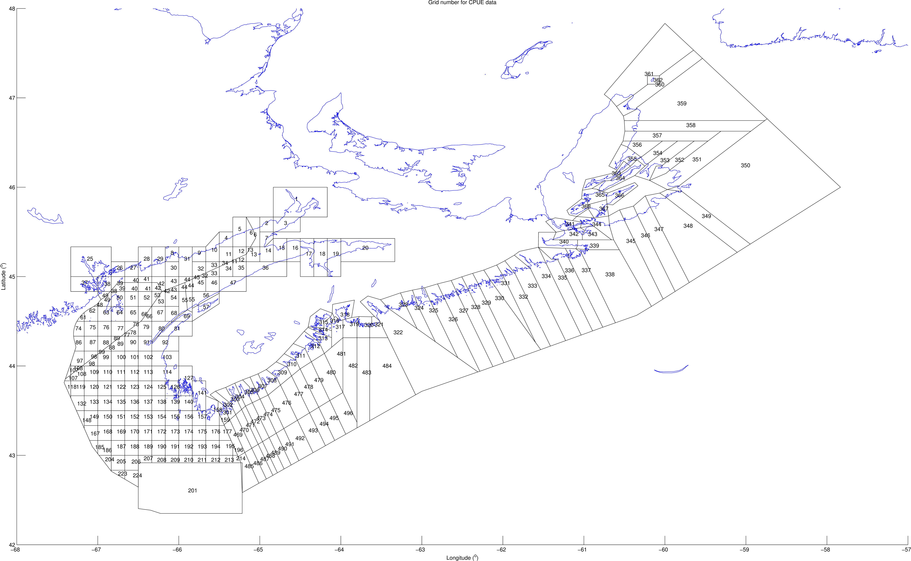

```{r setup, include=FALSE}
knitr::opts_chunk$set(echo = TRUE)
```

##INTRODUCTION


The American lobster (Homarus americanus) is currently the most important species in the fishing industry in North America. [I will be citing Le Bris et al. 2017 and Desjardins 2007.] [@LeBris2018]


The increase of lobster supply depends on the species’ range in an area. [I will cite Le Bris et al. 2017.]


According to DISP 2018’s research project on the correlation between the bottom of the ocean’s temperature and the number of catches of the American Lobster in Nova Scotia, the lobster industry could catch lobster at a higher rate with a seasonal increase in temperature. [I will cite Arpin et al. 2018.]


Marine heatwaves (MHWs) are defined as a period during which the seawater surpasses the 90th percentile of temperatures recorded over the last 30 years, during a minimum of five consecutive days. [I will be citing the following papers Hobday et al. 2016, Zhang et al. 2013 and Caputi et al. 2016.] @Hobday2016


The purpose of this study is to determine the effects of marine heatwaves on lobster and whether there is an optimal heat to increase their abundance. [I will cite Schlegel et al. 2018.]


##METHODS

Data Collection

The fieldwork for this study took place on multiple fishing boats around the coastline of Nova Scotia for ten years. [In this paragraph, I will be discussing the methodology used to obtain data in the field and the setting it took place in.]


Data Analysis

The DISP 2019 research project will analyze the collected data from the fieldwork using R. [This paragraph will discuss the procedure used to analyze the data including how it will be represented.]

[@Camacho2006]




@R2019
@Schlegel2018

# References