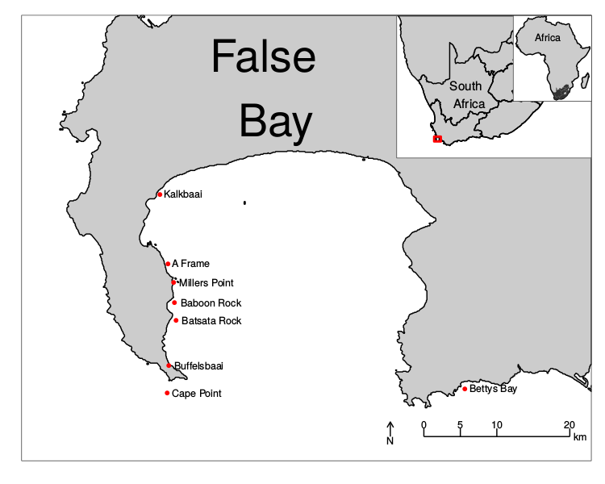

```{r, echo = FALSE}
library(knitr)
```

## Why use R?
  
- Its free!
- Its not Microsoft
- One program
- Human readable
- Community support
- Statistical analyses
- Graphing capabilities
- Reproducible research

## Reproducible research
  
Why must our research be reproducible?

```{r, echo = FALSE, out.width = "350px", fig.align='left'}

```

## Reproducible research
  
How does excel fail in this regard?
  
```{r, echo = FALSE, out.width = "500px", fig.align='left'}

```

## Reproducible research
  
Why do people still use it anyway?
  
```{r, echo = FALSE, out.width = "450px", fig.align='left'}

```

## Benefits of R
  
There are many ways in which R may make our lives easier:
  
- Streamline work flow
- Simplify complex tasks
- Reuse old scripts
- Use other peoples scripts
- Create beautiful figures
- Manage large data files
- What else?

## Streamline workflow
  
Load -> Prepare -> Process -> Graph

```{r, echo = FALSE, out.width = "800px", fig.align='left'}
include_graphics("graph/tidyr_workflow.png")
```

## Simplify complex tasks
  
```{r, eval=FALSE}
ggplot(site1, aes(x = month, y = temp)) +
  geom_boxplot(outlier.colour = "red", outlier.size = 2.0, size = 1.0) +
  geom_hline(data = annual1, linetype = "solid", size = 1.0, aes(yintercept = mean)) +
  geom_text(data = annual1, size = 5.0, 
            aes(x, y, label = paste("", signif(mean, digits = 3), " ± ", 
                              signif(sd, digits = 2), " °C", sep = ""))) +
  ylab(expression(paste("Temperature (",degree,"C)")))
```

##
```{r, echo = FALSE, out.height = "600px", out.width = "900px", fig.align='center'}

```

## Simplify complex tasks
  
```{r, eval=FALSE}
ggplot(insituMonthlyMultisite_v3.3, aes(x = month, y = temp, fill = src)) +
  geom_boxplot(outlier.colour = "red", outlier.size = 0.5, size = 0.1) +
  geom_hline(data = annual, linetype = "solid", size = 0.4, 
             aes(yintercept = mean, colour = src, alpha = 0.6)) +
  geom_text(data = annual, size = 1.5, 
            aes(x, y, label = paste("", signif(mean, digits = 3), " ± ", 
                                    signif(sd, digits = 2), " °C", sep = ""), 
                group = src, colour = src)) +
  ylab(expression(paste("Temperature (",degree,"C)"))) +
  facet_wrap(~ site, ncol = 10)
```

##
```{r, echo = FALSE, out.height = "600px", out.width = "900px", fig.align='center'}

```

##
```{r, echo = FALSE, out.height = "400px", out.width = "900px", fig.align='center'}

```

##
```{r, echo = FALSE, out.height = "600px", out.width = "800px", fig.align='center'}

```

##
```{r, echo = FALSE, out.height = "500px", out.width = "900px", fig.align='center'}

```

##
```{r, echo = FALSE, out.height = "600px", out.width = "900px", fig.align='center'}

```

## Make data more manageable
  
Our datasets are becoming larger and larger.
  
```{r, echo = FALSE, out.width = "500px", fig.align='left'}

```

- Who here has used a dataset with more than 100 rows of data?
- More than 1,000?
- More than 1,000,000?

## Big Data

We hear this term more and more... but what does it mean?
  
```{r, echo = FALSE, out.width = "600px", fig.align='left'}

```

## Big Data
  
> Noun: An accumulation of data that is too large and complex for processing by traditional database management tools.
  
```{r, echo = FALSE, out.width = "400px", fig.align='left'}

```

## Science Careers
  
But what does all of this have to do with you?
  
```{r, echo = FALSE, out.width = "700px", fig.align='left'}

```
  
The standards for good science are rising.

## Science Careers
  
Planning on leaving Academia after your undergraduate degree?
  
Knowledge of R or other command line programs is a highly salable skill.
  
```{r, echo = FALSE, out.width = "500px", fig.align='left'}

```
  
Excel is no longer good enough.

## Real world example
  
South African Coastal Temperature Network (SACTN):
  
- Data provided by 7 different sources
- Combined into a daily product
- Roughly 970,000 days of data
- Over 2,600 years of data

## SACTN
  
R is used to:
  
- Manage data
- Perform analyses
- Create data products
- [Create web app for data access](https://robert-schlegel.shinyapps.io/SACTN/)
- Write reports
- Prepare presentations
- Compile research articles

##
```{r, echo = FALSE, out.height = "500px", out.width = "700px", fig.align='center'}

```
