***
# What are they? {.tabset}

## text
<font size="6">"A prolonged discrete anomalously warm water event that can be described by its duration, intensity, rate of evolution, and spatial extent." </font>

@Hobday2016

## figure
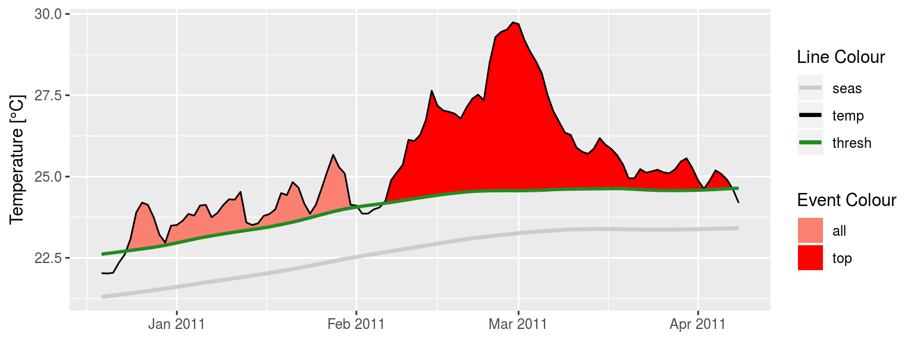  

## Definition {.tabset}

### Time series


### Daily boxes
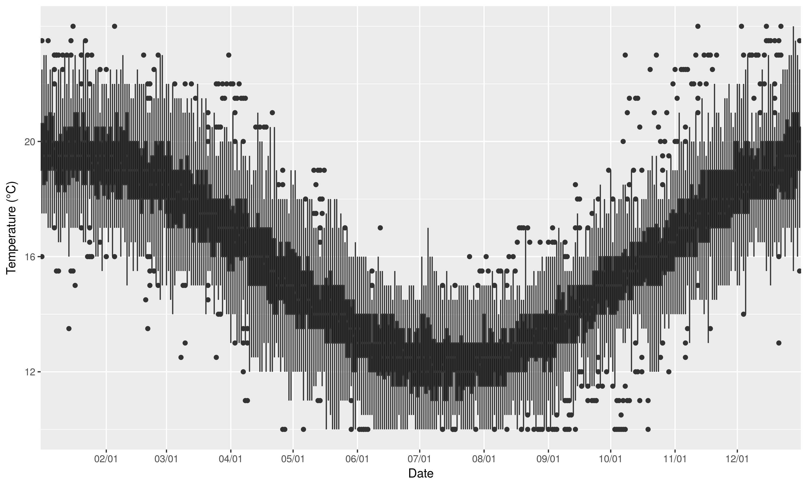

### Thresholds
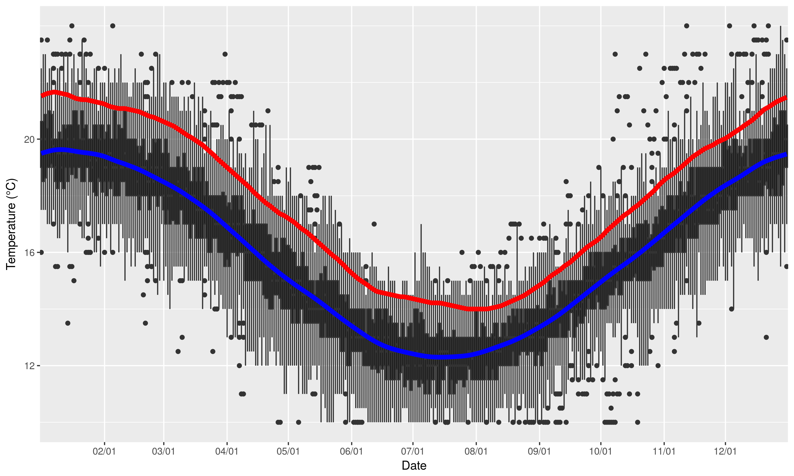

### Flames
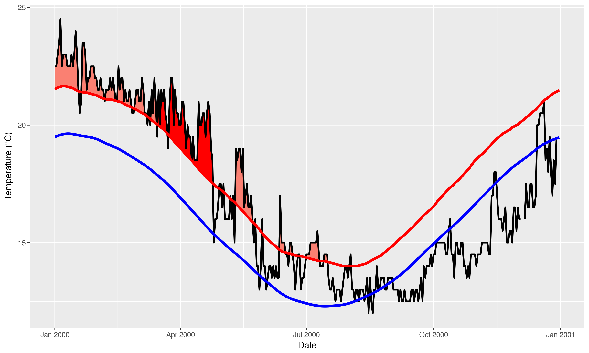

### Lollis
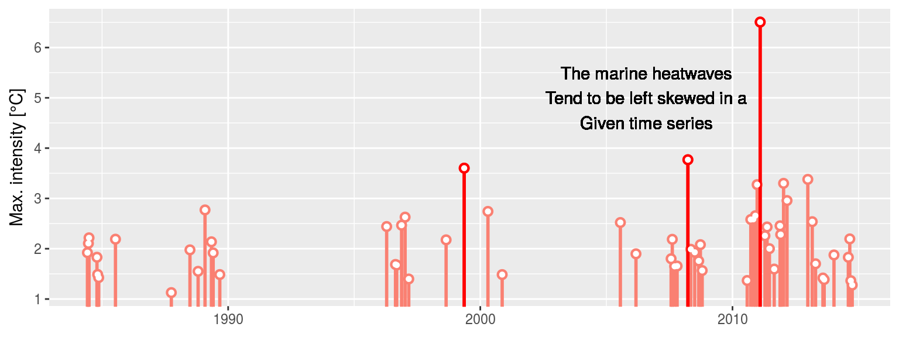

<!-- *** -->
## Marine Cold-spells

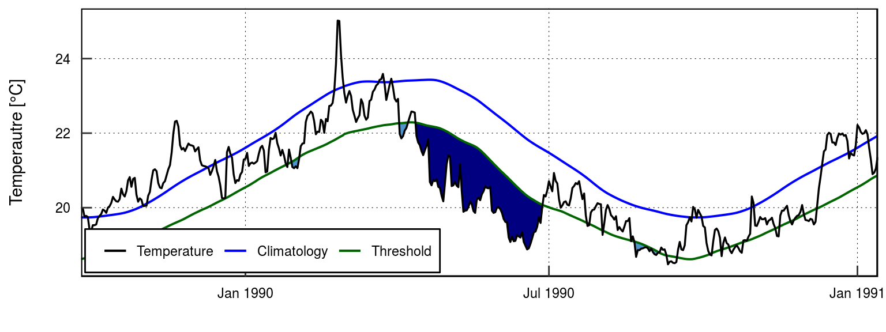  

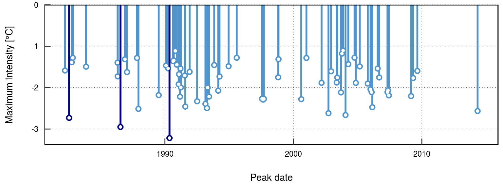


***
# Why should we care?

## GBR
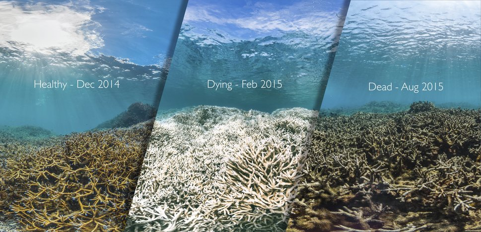

## The Blob {.tabset}

### Fish
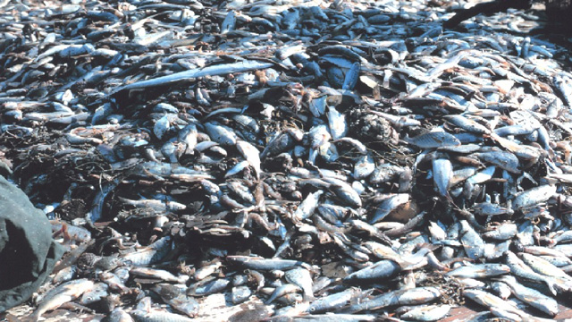

### Birds
```{r, out.width = "400px", echo=F}
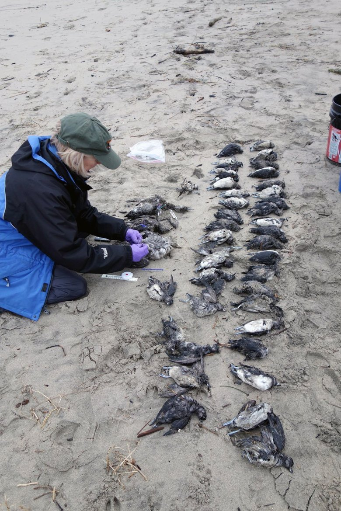
```

### Mammals
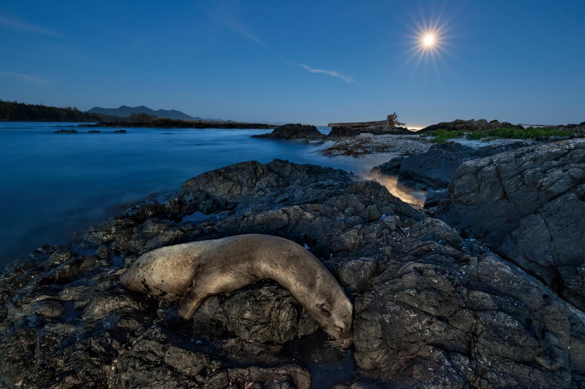


***
## The NW Atlantic {.tabset}

### Crabs
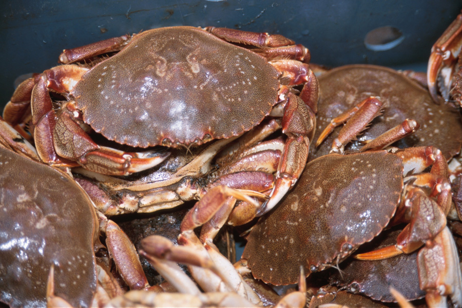

### Lobsters
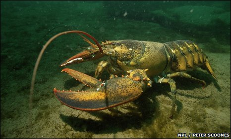


***
# What are we doing about it? {.tabset}

## International Working Group
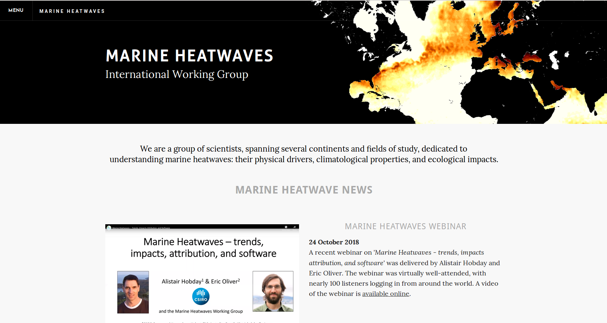  

<http://www.marineheatwaves.org/>


***
## MHW tracker
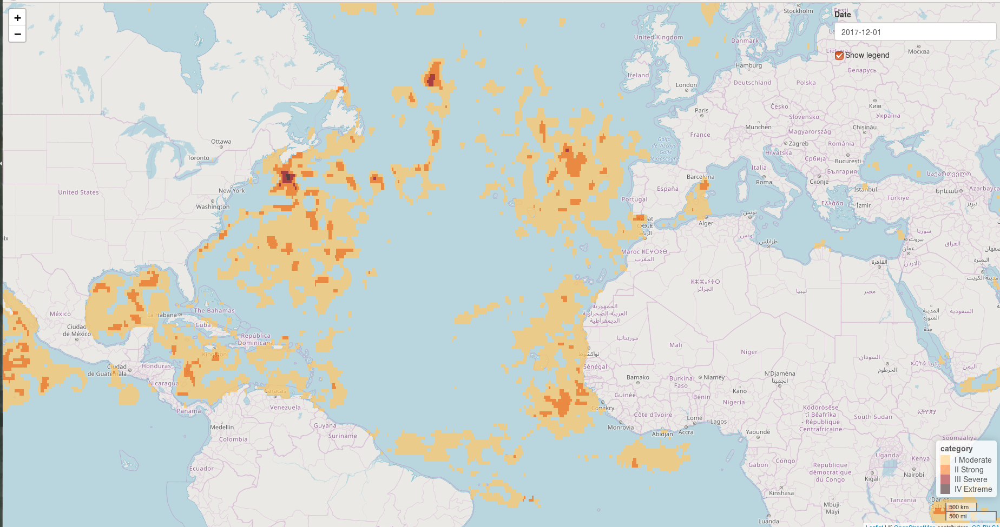  

<https://robert-schlegel.shinyapps.io/MHWtracker/>


***
## Open source code
```{r fig.width = 6, fig.height = 8, echo = FALSE, out.extra = 'style="float:left"'}
knitr::include_graphics("graph/python_logo.png")
```
```{r fig.width = 6 , fig.height = 8, echo = FALSE, out.extra = 'style="float:left"'}
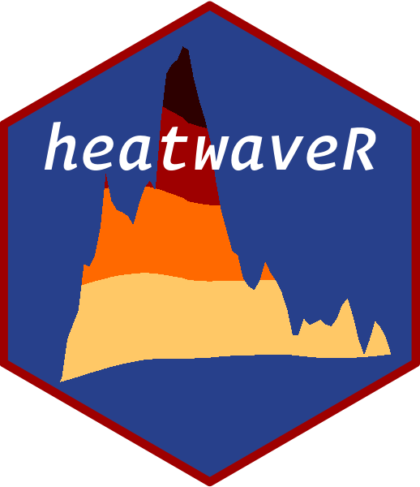
```
  
  
***
## DISP {.tabset}
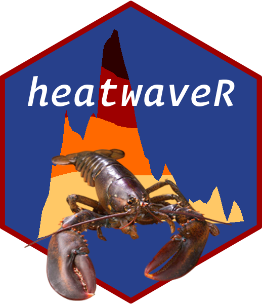
<font size="6">"Homarus americanus" </font>

### Temperature
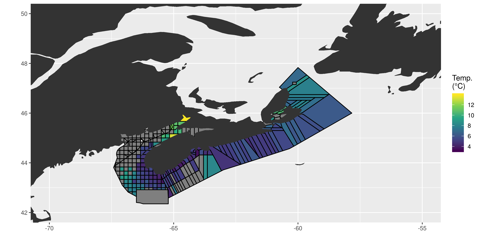

### CPUE
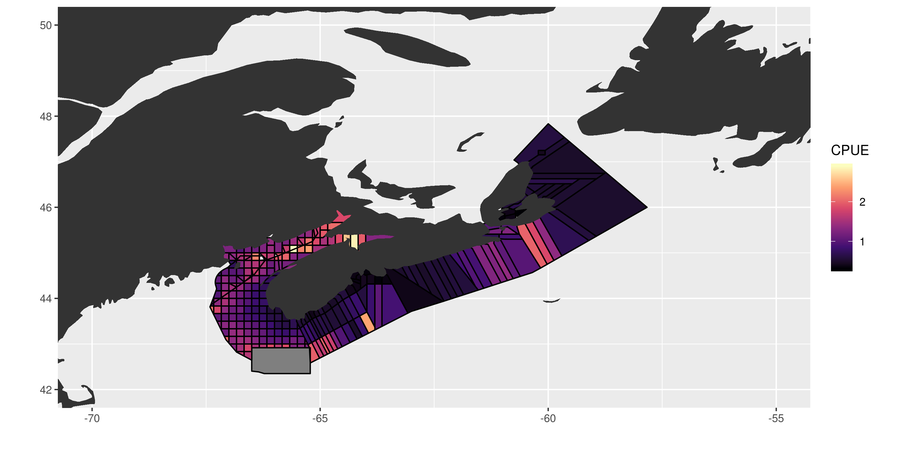


***
# Questions? 


***
# References