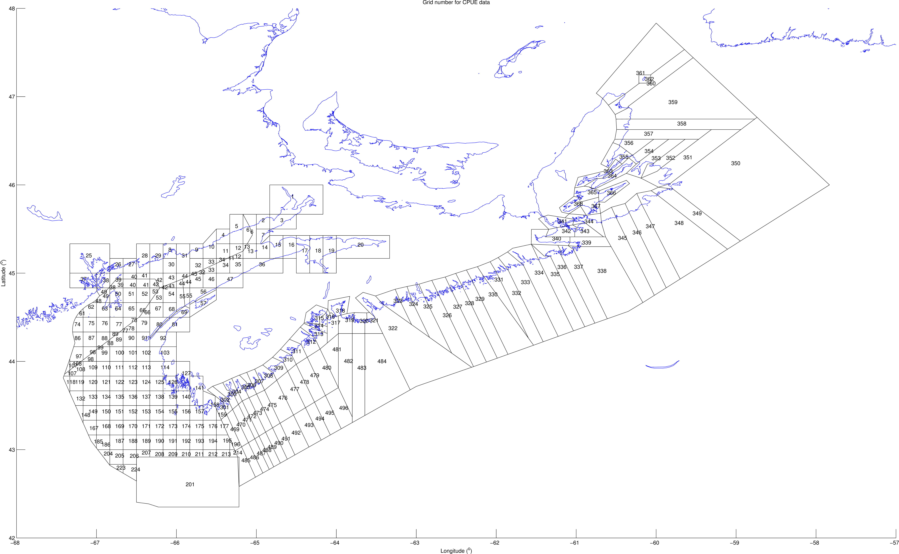

```{r setup, include=FALSE}
knitr::opts_chunk$set(echo = TRUE)
```

According to @Hobday2016, MHWs last for at least five days.

Lobsters are known to enjoy hot water, on occasion [@LeBris2018].



# References